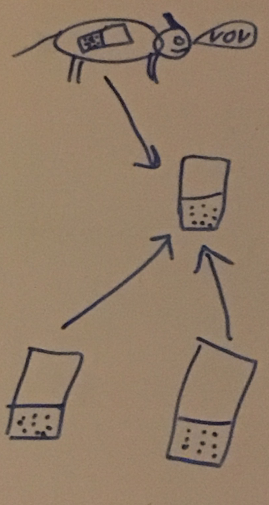

# beacon-mountain
P2P position app. This is a phone app that can act both as a server and as a client. All clients send their nickname and position to the server. The server keep track on all connected clients and return their positions when a client post a new location. 

NOTE1: All communication is directly between the phones via GPRS (no data is stored anywhere except on the phone acting as a server) 

NOTE2: If you are using WIFI on your phone, this app will most probably not work since it's behind a firewall and/or you have a private IP number. 

The app is written for Android and IOS

Some use-cases for the app:
* For hunting. Place a app in client-mode on a dog and let one hunter have the app in server-mode. Other hunter-clients might connect to the server and view where the dog/other hunters are located
* For monitoring. To keep track on where your family/group are located at all times (for example in a market place/concert)

## Overview of the communication

1. An app is started in server mode
2. One or more apps is started in client mode. When the client starts it can choose to input the servers IP directly or leave blank for receiving an SMS with servers IP from the server
3. (optionally) The server can send one/more SMS:es to the clients (currently using the servers phone's address book)
4. (optionally) The client receives the SMS from the server, within the app (with the servers IP)

The connection between the client(s) and the server is now established. All clients initiates the connection to the server.

5. The client send their nickname, position and a flag telling the server if the client wish the receive all other clients positions or not (a client unit attached on a dog, for example, might not need all others positions)
6. The server replies with nothing (if the flag is 'N') or the nicknames and postions of all other clients (and the server)

## Current status

Android:

* No map is shown yet

IOS:

* No map is shown yet
* The server and client protocol part in not yet finished

## Protocol

The protocol between the client and server app's is named YAPP (Yet Another Protocol Protocol). As mentioned above, all communication is initiated from the client. 

The app acting as a server is listening on port 4711

Currently the protocol looks like this (NOTE breaking changes might be coming):

### To server:

<pre>
HELO:&lt;nickname&gt;:&lt;latitude&gt;:&lt;longitude&gt;:&lt;answer&gt;\0

&lt;nickname&gt;  is the name of the connecting client
&lt;latitude&gt;  is the latitude in WGS84 coordinates
&lt;longitude&gt; is the longitude in WGS84 coordinates
&lt;answer&gt;    is 'N' or 'Y'. If 'N' is sent the client don't want a reply. 'Y'
            means the client want the nicknames and positions for all connected
            clients

Example: HELO:Nick:54.3176:93.1234:N\0
</pre>

### From server:

<pre>
The 'N' case:

YOLO\0

The 'Y' case:

DATA:&lt;number of records&gt;:&lt;nickname i&gt;:&lt;latitude i&gt;:&lt;longitude i&gt;\0
&lt;number of records&gt; The number of connected clients (including the server)
&lt;nickname i&gt;        i=1..&lt;number of records&gt; The name
&lt;latitude i&gt;        i=1..&lt;number of records&gt; The latitude
&lt;longitude i&gt;       i=1..&lt;number of records&gt; The longitude

Example 1: DATA:0\0
Example 2: DATA:2:Nick:54.3176:93.1234:Nina:54.3312:93.1245\0

</pre>

## Possible enhancements

* Save position data more permanent (in a database) on the server
* Let the server remember the nicknames in a group
* Let the server give the group a name
* Control the interval, how often the clients send their positions to the server. (A dog might for example send their positions more often than other clients)

